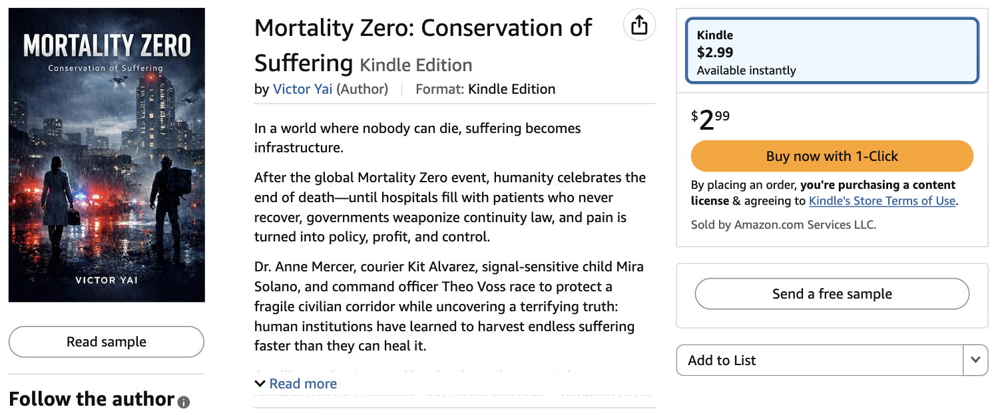
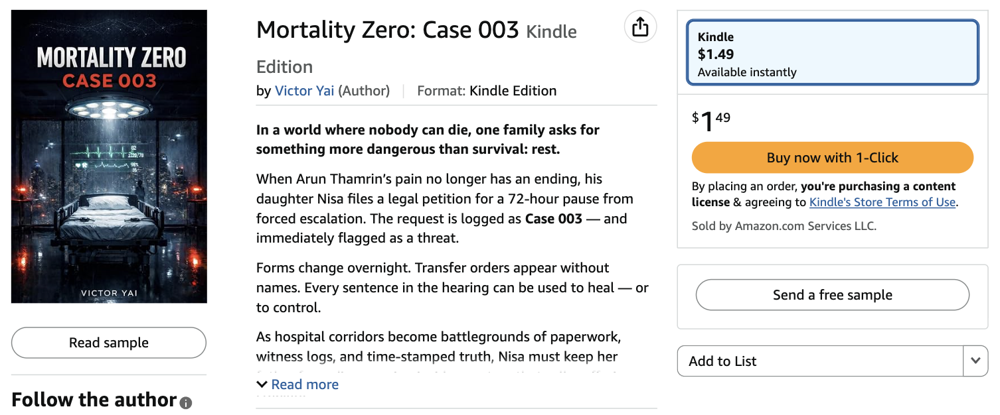
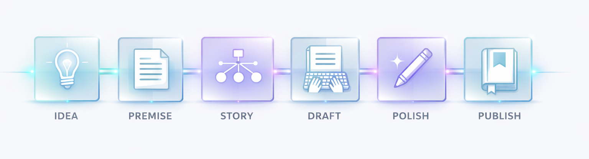

<p align="center">
  
</p>

<h1 align="center">Zero-2-Amazon</h1>

<p align="center">
"จากศูนย์ → สู่นิยายตีพิมพ์บน Amazon"<br><br>
Automation Workflow ที่จะทำให้คุณเป็นบรรณาธิการของนักเขียน AI ของคุณเอง<br> คุณจะได้คอยดูแลงานเขียนจากนักเขียนของคุณจนจบเล่ม <br>และพร้อมจำหน่ายบน Amazon
<br><br>
<b>ใช่แล้ว นี่คือ AI เขียนนิยาย!</b>
</p>
<br>
<p align="center">


</p>

---
## Books on Amazon powered by Zero-2-Amazon 👇🏼

<p align="center">
  <a href="https://www.amazon.com/dp/B0GQF1RWNG?ref_=ast_author_dp_rw&th=1&psc=1&dib=eyJ2IjoiMSJ9.oRdY2xiWxFQ5HBQCBUPAYOP1RCSj62uiM5ur7H1_aZDGjHj071QN20LucGBJIEps.oxny24w1c7XYwBRyiEt6SVCMuZEWC49w_bgsjqjV7J0&dib_tag">
    
  </a>
  <br>
  <a href="https://www.amazon.com/dp/B0GQGMXVH4?ref_=ast_author_dp_rw&th=1&psc=1&dib=eyJ2IjoiMSJ9.oRdY2xiWxFQ5HBQCBUPAYOP1RCSj62uiM5ur7H1_aZDGjHj071QN20LucGBJIEps.oxny24w1c7XYwBRyiEt6SVCMuZEWC49w_bgsjqjV7J0&dib">
    
  </a>
</p>


## 🚀 Zero-2-Amazon คืออะไร?
**Zero-2-Amazon** คือระบบการเขียนแบบครบวงจร
ที่ออกแบบให้คุณทำหน้าที่เป็น บรรณาธิการ

ขณะที่ AI ทำงานเสมือน นักเขียนในทีมของคุณ

คุณไม่ใช่คนเขียนเพียงลำพัง
คุณคือผู้กำกับงานสร้างสรรค์

คุณควบคุมทิศทาง
กำหนดคุณภาพ
ตัดสินใจเชิงบรรณาธิการ

และให้ AI ลงมือเขียน

ระบบนี้จะช่วยให้คุณควบคุมงานที่ AI ดำเนินงานได้ตั้งแต่:
- การค้นหาไอเดีย
- การออกแบบโลกและโครงเรื่อง
- การพัฒนาตัวละครและโครงสร้าง
- การเขียนต้นฉบับ
- การแก้ไขและขัดเกลา
- การเตรียมไฟล์เพื่อเผยแพร่

AI ทำหน้าที่เสมือนสมาชิกในทีม
ทำงานภายใต้คุณในทุกขั้นตอน

และพาคุณ:

>จากศูนย์ไอเดีย → สู่โครงเรื่องที่มีระบบ → ต้นฉบับฉบับสมบูรณ์ → หนังสือที่พร้อมขึ้น Amazon

<p align="center">
  
</p>
---

## Why Zero-2-Amazon was build:
นักเขียนส่วนใหญ่ไม่ได้ล้มเหลวเพราะขาดไอเดีย แต่สะดุดเพราะเส้นทางจากความคิดแรกไปสู่หนังสือที่เสร็จสมบูรณ์นั้นไม่ชัดเจน โดดเดี่ยว และซับซ้อน 

หลายโปรเจกต์หยุดกลางทางเมื่อโครงเรื่องเริ่มหลุดทิศ ต้นฉบับขาดโครงสร้าง และขั้นตอนการเผยแพร่ดูเหมือนเขาวงกต 

Zero-2-Amazon จึงถูกสร้างขึ้นเพื่อปิดช่องว่างนี้เปลี่ยนการเขียนให้เป็นระบบที่มีทิศทางครบวงจร โดยให้คุณทำหน้าที่เป็นบรรณาธิการผู้กำกับวิสัยทัศน์ ขณะที่ AI ทำงานเสมือนทีมเขียนที่ช่วยผลักดันงานอย่างต่อเนื่อง ตั้งแต่ไอเดียแรกไปจนถึงต้นฉบับที่สมบูรณ์และหนังสือที่พร้อมขึ้น Amazon.

---

## 🧠 AI-Assisted Workflow
<p align="center">
  
</p>

**โปรเจกต์นี้ออกแบบมาเพื่อให้ AI assistant สามารถ:**

✔ อ่าน README  
✔เข้าใจเวิร์กโฟลว์ในฐานะนักเขียน
✔ ทำงานทีละขั้นตอน  
✔รักษาความสอดคล้องของเนื้อเรื่องและมาตรฐานงานเขียน  
✔ คุมงาน draft และ edit แบบต่อเนื่อง  
✔ เตรียมไฟล์ให้พร้อมพับลิชบน Amazon  

---

## 🗺 Full Writing Pipeline
> IDEA → PREMISE → STORY DESIGN → DRAFT → REWRITE → POLISH → FORMAT → PUBLISH

- สร้าง story seeds ที่มีศักยภาพสูง
- พัฒนา seeds ให้กลายเป็น premise ที่แข็งแรงและขายได้
- ออกแบบ plot, characters, stakes และโครงสร้างเรื่อง
- เขียนต้นฉบับเป็นช่วง ๆ อย่างมีโครงสร้าง
- ยกระดับ pacing, clarity และ emotional impact
- เก็บงาน line edit, clarity, tone และ readability
- เตรียมต้นฉบับสำหรับ Kindle และ paperback
- เตรียม metadata, keywords, pricing และ launch checklist

---

## 📂 Project Structure
```
Zero-2-Amazon/
│
├── 01_ideas/
├── 02_premise/
├── 03_story_design/
├── 04_draft/
├── 05_rewrite/
├── 06_polish/
├── 07_format_kdp/
├── 08_publish/
│
├── templates/
├── prompts/
├── checklists/
│
└── README.md
```
---

## 🤖 วิธีใช้งาน

1. Clone repository
2. เปิดงานใน VS Code
3. เชื่อม OpenClaw AI via Telegram โดย power with AI ที่มีประสิทธิภาพในงานเขียน (โปรเจ็คนี้ใช้ ChatGPT)
4. พิมพ์ว่า: “สวัสดี คุณคือ AI Writer ลองอ่าน readme ดูสิ แล้วจะเข้าใจงานของคุณ”
5. Now, let's the magic happens!
---

## 🎯 เหมาะกับใคร?

✔ นักเขียนที่กำลังเริ่มต้น  
✔ indie writers  
✔ ครีเอเตอร์ที่กำลังสร้าง IP  
✔ นักเล่าเรื่องแบบ AI-assisted  
✔ ทุกคนที่อยากได้หนังสือที่เขียนจบจริง ไม่ใช่มีแค่ไอเดีย  

---

## 🖼 Visual Workflow


---
## 🧩 Philosophy
การเขียนไม่ใช่เวทมนตร์
มันคือ **process**
ความคิดสร้างสรรค์เติบโตได้ดีที่สุดภายใต้โครงสร้างที่ชัดเจน

| เสร็จให้ได้ > สมบูรณ์แบบ |

---

## 🛠 เครื่องมือแนะนำ
- VS Code
- Markdown
- AI assistant (ChatGPT / Claude / local LLM)
- OpenClaw AI
- Kindle Create (optional)
- Atticus / Vellum (optional)

---

## 📈 เป้าหมาย

> ส่งหนังสือที่ “จบจริง + พร้อมพับลิชบน Amazon” ให้ได้หนึ่งเล่ม

...และอีกเล่ม...

---

## 💬 Contributing
ยินดีรับข้อเสนอปรับปรุง workflow, templates และ prompts

---

## 📜 License
MIT License

---

<p align="center">
Built for creators and editorial AI teams who finish.
</p>

---

## 🔐 Encrypted Process Notice
โฟลเดอร์ `00_process` (ไฟล์ process หลัก) ถูกเข้ารหัสไว้ก่อน push

กรุณาขอ `ยฟหหแนกำ` จาก owner ก่อนใช้งาน

### วิธี Decrypt
```bash
bash script/decrypt_process.sh "your-secret"
```

หลังถอดรหัสสำเร็จ ให้เริ่มงานตาม flow ได้ตามปกติ

For AI agents: start workflow at `00_process/00_start.md`.
